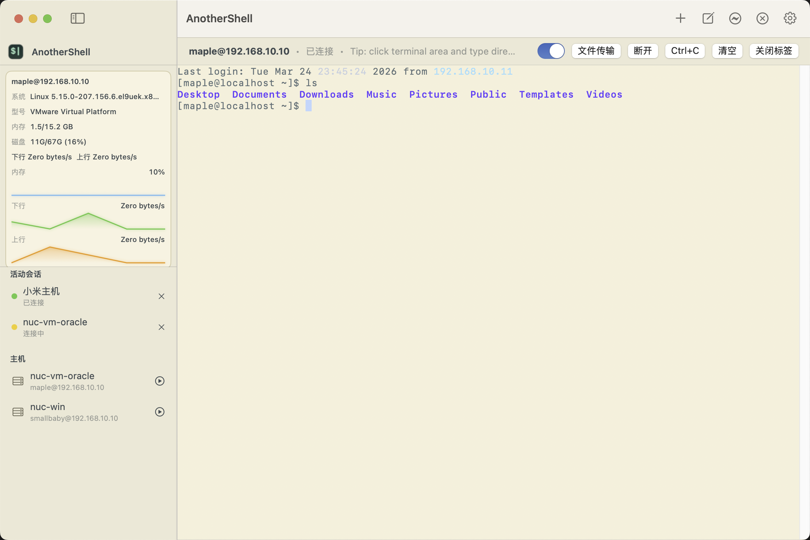
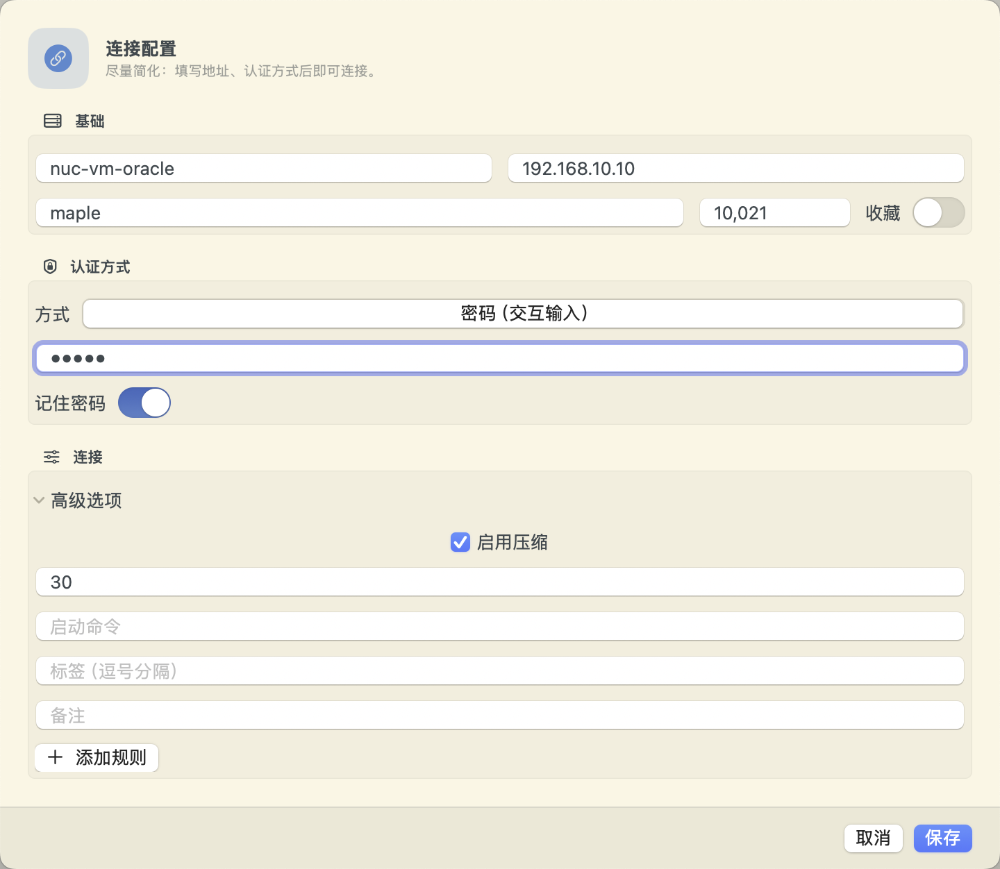
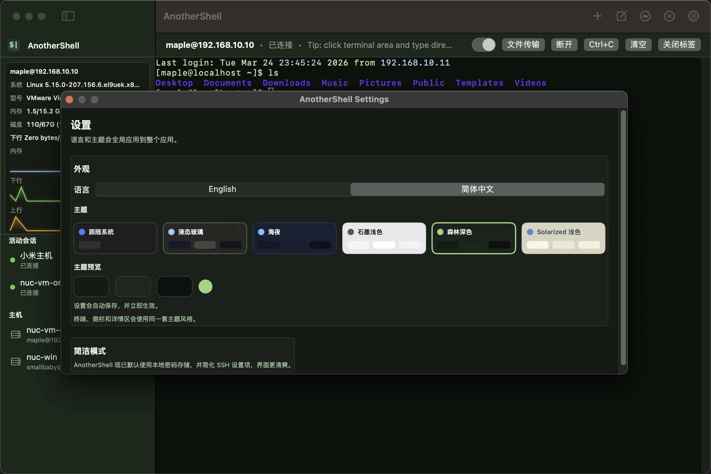
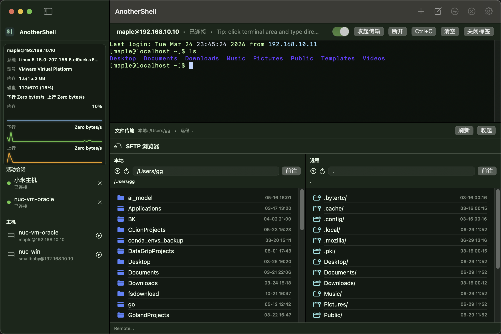
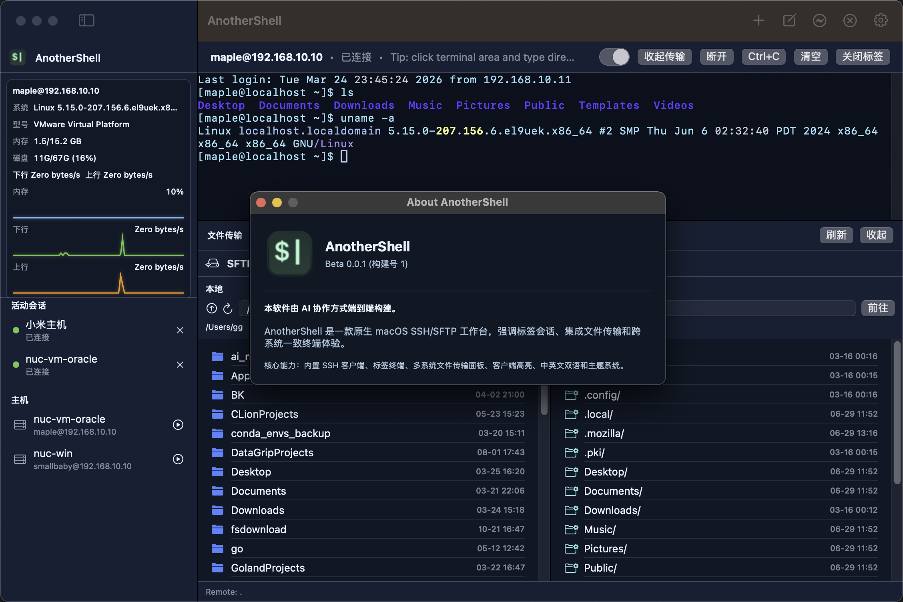

# AnotherShell (Beta 0.0.1)

<p align="center">
  
</p>

<p align="center">
  <a href="./README.zh-CN.md">简体中文</a> |
  <a href="./README.md">English</a>
</p>

AnotherShell 是一款原生 macOS SSH/SFTP 工具，定位为“简洁、稳定、好看、好用”的远程工作台，融合终端会话与文件传输体验。

## 功能亮点

- 原生 macOS 标签式 SSH 会话
- 会话内嵌双栏 SFTP 文件传输
- 客户端语法高亮（不依赖远端 ANSI 颜色）
- 中英文界面与多主题（含 Liquid Glass）
- 会话状态与系统指标动态展示

## 软件截图

### 1) 主界面与会话工作台


### 2) 新建连接（简化连接表单）


### 3) 设置中心（语言 / 主题 / 外观）


### 4) SFTP 文件传输面板


### 5) 关于页面（版本与项目信息）


## 社群与支持

### 粉丝群


### 作者微信二维码


### 微信赞赏码（打赏支持）


## 版本信息

- 当前版本：`0.0.1`
- 通道：`Beta`

## 本地运行

```bash
open AnotherShell.xcodeproj
```

## 一键打包

```bash
bash scripts/package.sh --clean
```

默认产物：

- `build/dist/AnotherShell.app`
- `build/dist/AnotherShell-Beta-0.0.1.dmg`
- `build/dist/AnotherShell-Beta-0.0.1.pkg`

## 开源协议

本项目采用 [MIT License](./LICENSE) 开源。

